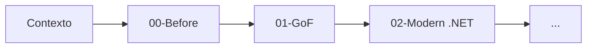
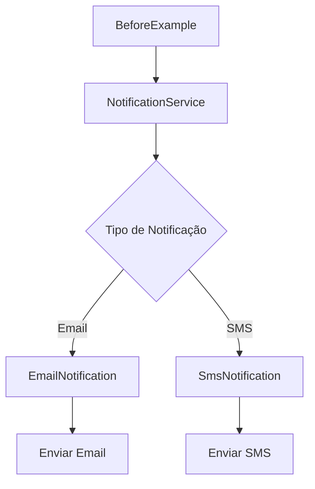

# Factory Method

## Contexto

Estamos construindo um sistema de notificações que precisa enviar mensagens por diferentes canais.

Inicialmente, o sistema oferece suporte a dois tipos de notificação:

- Email
- SMS

O sistema recebe o tipo de notificação, o destinatário e a mensagem, sendo responsável por enviar a notificação pelo canal apropriado.

Neste estágio, os requisitos são intencionalmente simples. O objetivo não é introduzir abstrações prematuramente, mas começar com uma implementação direta e observar como o design evolui à medida que novos requisitos são introduzidos.

Os exemplos deste estudo evoluirão a partir dessa implementação inicial em direção à solução clássica do **Factory Method**, proposta pela Gang of Four (GoF), seguida por considerações sobre aplicações .NET modernas.

---

## Objetivo

O objetivo deste estudo é compreender o padrão **Factory Method**, desde o problema que o motiva até suas diferentes implementações.

O estudo não se concentra apenas em como implementar o padrão, mas também em compreender:

- Quando o problema realmente surge;
- Por que uma implementação mais simples pode ser preferível inicialmente;
- Como o aumento dos requisitos expõe limitações no design;
- Como o Factory Method aborda essas limitações;
- Quais trade-offs são introduzidos pelo padrão;
- Como o mesmo design pode ser abordado em aplicações .NET modernas.

---

## Caminho de Aprendizado

Os exemplos são organizados como uma evolução incremental do mesmo cenário.



Cada estágio representa um ponto diferente na evolução do design.

O padrão não é introduzido simplesmente porque ele existe. Ele é introduzido quando o problema demonstra que a abstração adicional é justificada.

---

## 00-Before

### Contexto

A versão inicial do sistema de notificações oferece suporte a dois canais:

- Email
- SMS

O `NotificationService` recebe o tipo de notificação e decide qual implementação concreta de notificação deve ser criada e utilizada.

Neste momento, a implementação é intencionalmente direta.

Não existe interface, creator abstrato, hierarquia de factories ou injeção de dependência.

### Implementação Inicial

A aplicação segue este fluxo:



O `NotificationService` contém a decisão sobre qual classe concreta de notificação deve ser instanciada.

Conceitualmente, a implementação segue esta estrutura:

```text
BeforeExample
      |
      v
NotificationService
      |
      +---- EmailNotification
      |
      +---- SmsNotification
```

### Decisões de Design

A implementação inicial mantém o design intencionalmente simples.

#### Ainda não há Interface

Existem apenas dois tipos concretos de notificação e, neste estágio, não há um requisito que determine que diferentes implementações precisem ser intercambiáveis por meio de uma abstração.

Introduzir uma interface neste momento adicionaria uma camada de indireção sem resolver um problema existente.

#### O Serviço é Responsável pela Decisão de Criação

Atualmente, o `NotificationService` sabe qual classe concreta deve ser criada para cada tipo de notificação.

Para os requisitos iniciais, essa é uma solução direta e de fácil compreensão.

#### Implementações Concretas

`EmailNotification` e `SmsNotification` são classes concretas responsáveis por seus respectivos mecanismos de entrega.

Não existe uma hierarquia de herança porque os requisitos atuais não demandam uma.

### Limitações Atuais

Embora a implementação seja simples, o `NotificationService` está diretamente acoplado às implementações concretas de notificação.

À medida que o número de tipos de notificação aumenta, o serviço precisará ser modificado para acomodar cada novo tipo.

Por exemplo, a introdução de canais adicionais, como:

- WhatsApp;
- Push Notification;
- Slack;
- Webhook;

exigiria alterações na lógica de decisão existente.

Neste estágio, isso não é necessariamente um problema. O ponto importante é reconhecer a direção na qual o design está evoluindo.

O próximo estágio introduzirá novos requisitos e permitirá avaliar se o design atual continua sendo adequado.

---

## 01-GoF

Neste estágio será introduzida a solução clássica do **Factory Method**, descrita pela Gang of Four.

O objetivo é compreender como o padrão separa a criação dos objetos do código que utiliza esses objetos.

A implementação será desenvolvida a partir das limitações identificadas no estágio anterior.

---

## 02-Modern .NET

Após compreender a implementação clássica do GoF, este estágio explorará como objetivos de design semelhantes podem ser alcançados utilizando mecanismos comuns em aplicações .NET modernas.

O objetivo não é substituir automaticamente o padrão original, mas avaliar diferentes abordagens e compreender seus respectivos trade-offs.

---

## Referências

- Gamma, Erich; Helm, Richard; Johnson, Ralph; Vlissides, John. *Design Patterns: Elements of Reusable Object-Oriented Software*.
- Documentação do .NET da Microsoft.
