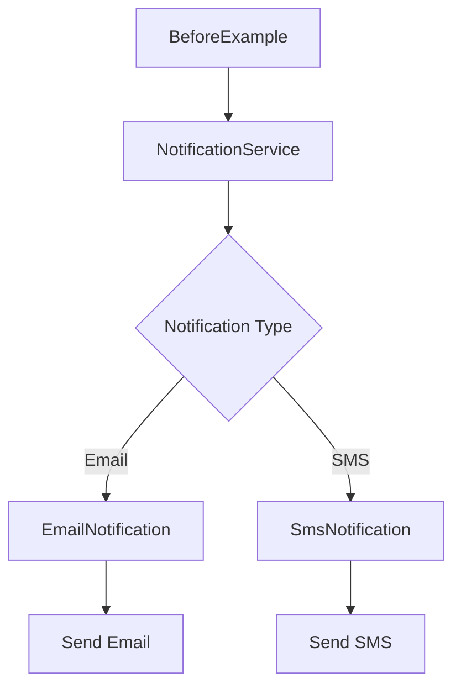

# Factory Method

## Context

We are building a notification system that needs to send messages through different channels.

Initially, the system supports two notification types:

- Email
- SMS

The system receives a notification type, a recipient, and a message, and is responsible for sending the notification through the appropriate channel.

At this stage, the requirements are intentionally simple. The goal is not to introduce abstractions prematurely, but to start with a straightforward implementation and observe how the design evolves as new requirements are introduced.

The examples in this study will evolve from this initial implementation toward the classic **Factory Method** solution proposed by the Gang of Four (GoF), followed by considerations for modern .NET applications.

---

## Objective

The objective of this study is to understand the **Factory Method** pattern from the problem that motivates it to its different implementations.

The study focuses not only on how to implement the pattern, but also on understanding:

- When the problem actually appears;
- Why a simpler implementation may be preferable initially;
- How increasing requirements expose design limitations;
- How Factory Method addresses those limitations;
- What trade-offs are introduced by the pattern;
- How the same design can be approached in modern .NET applications.

---

## Learning Path

The examples are organized as an incremental evolution of the same scenario.


Each stage represents a different point in the evolution of the design.

The pattern is not introduced simply because it exists. It is introduced when the problem demonstrates that the additional abstraction is justified.

---

## 00-Before

### Context

The initial version of the notification system supports two notification channels:

- Email
- SMS

A `NotificationService` receives the notification type and decides which concrete notification implementation should be created and used.

At this point, the implementation is intentionally straightforward.

There is no interface, abstract creator, factory hierarchy, or dependency injection.

### Initial Implementation

The application follows this flow:



The `NotificationService` contains the decision about which concrete notification class should be instantiated.

Conceptually, the implementation follows this structure:

```text
BeforeExample
      |
      v
NotificationService
      |
      +---- EmailNotification
      |
      +---- SmsNotification
```

### Design Decisions

The initial implementation intentionally keeps the design simple.

#### No Interface Yet

There are only two concrete notification types and no requirement at this stage that different implementations need to be interchangeable through an abstraction.

Introducing an interface now would add indirection without solving an existing problem.

#### The Service Owns the Creation Decision

`NotificationService` currently knows which concrete class should be created for each notification type.

For the initial requirements, this is a straightforward and understandable solution.

#### Concrete Implementations

`EmailNotification` and `SmsNotification` are concrete classes responsible for their respective delivery mechanisms.

There is no inheritance hierarchy because the current requirements do not demand one.

### Current Limitations

Although the implementation is simple, the `NotificationService` is directly coupled to the concrete notification implementations.

As the number of notification types increases, the service will need to be modified to accommodate each new type.

For example, introducing additional channels such as:

- WhatsApp;
- Push Notification;
- Slack;
- Webhook;

would require changes to the existing decision logic.

At this stage, this is not necessarily a problem. The important point is to recognize the direction in which the design is evolving.

The next stage will introduce new requirements and allow us to evaluate whether the current design continues to be appropriate.

---

## 01-GoF

This stage will introduce the classic **Factory Method** solution described by the Gang of Four.

The objective is to understand how the pattern separates the creation of objects from the code that uses those objects.

The implementation will be developed from the limitations identified in the previous stage.

---

## 02-Modern .NET

After understanding the classic GoF implementation, this stage will explore how similar design goals can be achieved using mechanisms commonly found in modern .NET applications.

The objective is not to replace the original pattern automatically, but to evaluate different approaches and understand their respective trade-offs.

---

## References

- Gamma, Erich; Helm, Richard; Johnson, Ralph; Vlissides, John. *Design Patterns: Elements of Reusable Object-Oriented Software*.
- Microsoft .NET documentation.
